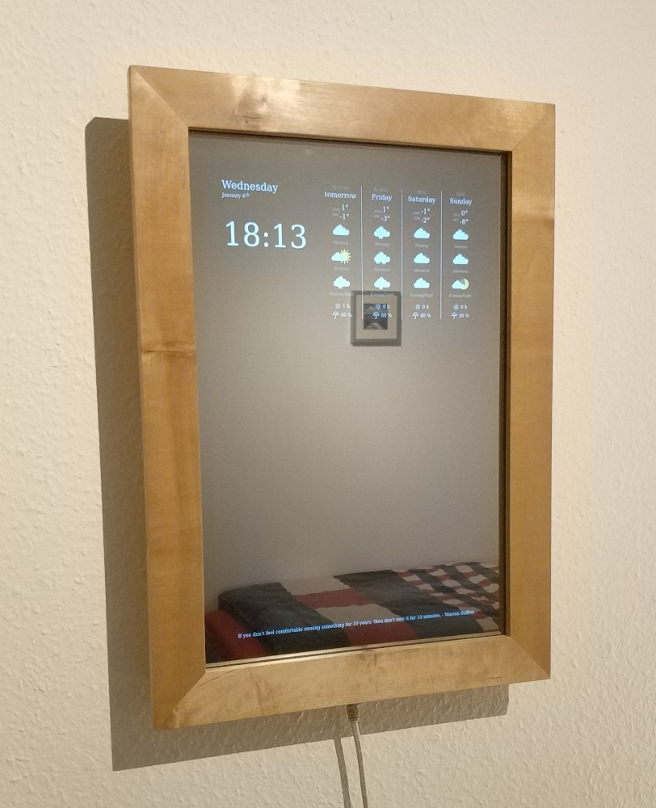

magic mirror
============

Simple flask app to provide a dashboard interface for a magic mirror.


## Setup

The best way to start is with a plain Raspberry Pi OS lite.
Enable auto login from commandline for the user `pi` in `sudo raspi-config`.
Also, you might want to adjust the time zone.

Next, clone this repository and add your openweather API key and city in [`weather.py`](app/weather.py).

Then, launch the setup script:
```bash
$ ./setup.sh
```

And add these lines to `/etc/crontab`:
```
# Turn monitor on
0 5     * * 1-5 root /usr/bin/vcgencmd display_power 1
0 6     * * 0,6 root /usr/bin/vcgencmd display_power 1

# Turn monitor off
0 22    * * * root /usr/bin/vcgencmd display_power 0

# Reload page every day
55 4    * * * pi /home/pi/.reload.sh
```

Probably you want to adjust the times for enabling and disabling the monitor.

## Impression

Here is a sample image of my mirror that I assembled a while ago.
It is mainly inspired by Dylan Pierce's [MirrorMirror](http://blog.dylanjpierce.com/raspberrypi/magicmirror/tutorial/2015/12/27/build-a-magic-mirror.html) project.


